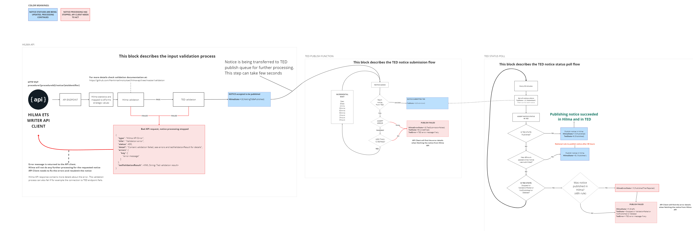

# Hilma eForms-notice publication process flow

When the following notice process ends in any of the "RED BOX" -states.
The api client needs to fix the errors and resubmit the notice through the HILMA endpoint. If TedState is NotPublished it means the notice was submitted to TED, but the notice failed TED validation (fe. lawfulness check). In that case the notice version needs to incremented before resubmitting the notice.

